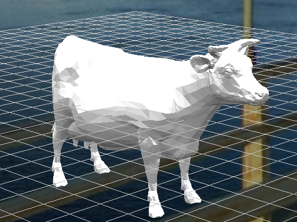

# Publish Triangular Mesh
This folder contains a Jupyter notebook showing how to create a triangular mesh object and then publish it into an Evo workspace. 

## Inputs
This sample code uses the ```cow.obj``` file (located in ```./data/input```) for the mesh vertex and index values.



## Outputs
- **object.json**: A .json file of the triangular mesh object that will be uploaded to workspaces
- **mesh_vectors**: .parquet and .csv file that is created from the .obj input file.  
- **mesh_indices**: .parquet and .csv file that is created from the .obj input file.
